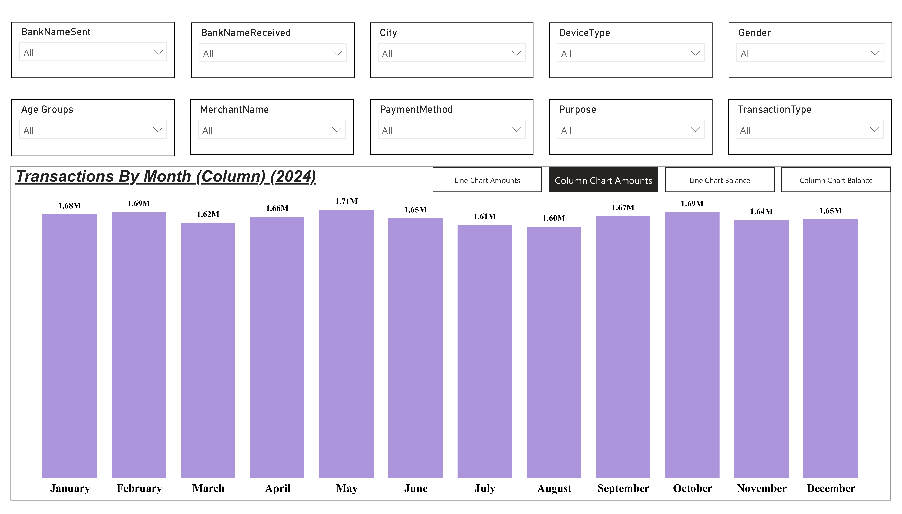
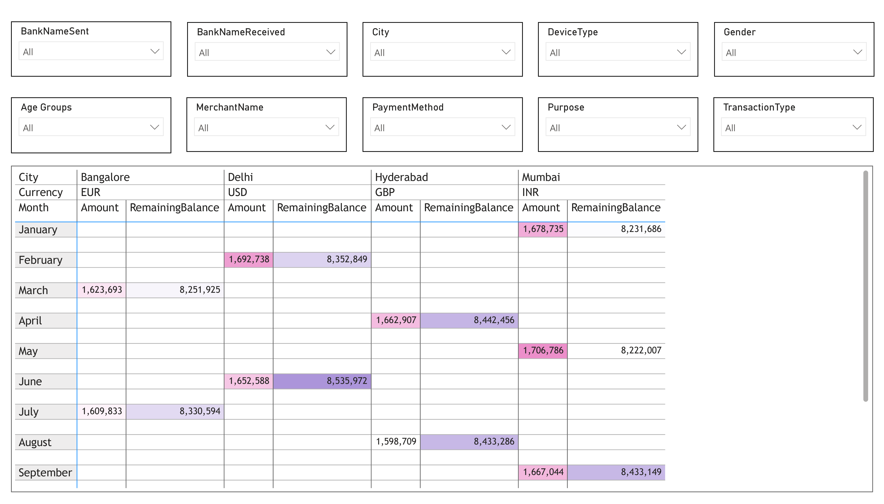

# UPI Transactions Analysis in Power BI

This Power BI dashboard explores a dataset of UPI transactions in India across various banks, cities, and user demographics. The goal of this project was to practice **Slicers**, **Bookmarks**, and **interactive navigation** in Power BI.

## 📌 Key Features

- **Slicers Used For Filtering:**
  - Bank Sent / Received
  - City
  - Gender
  - Device Type
  - Merchant Name
  - Age Group
  - Payment Method
  - Purpose
  - Transaction Type

- **Charts Included:**
  - Column Chart: Monthly Transaction Amounts (2024)
  - Matrix Table: Currency-wise Remaining Balances by City
  - Line & Column Charts via Bookmarks: Toggle between views
  - Interactive slicer panel for dynamic filtering

## 🧠 Learnings

- Applied **bookmarks** to switch between different chart views (Line vs Column).
- Implemented slicers across multiple visuals for cross-filtering.
- Understood how to work with categorical vs numeric data in dashboards.
- Improved layout & formatting for enhanced visual storytelling.

## 📂 File

- `UPI-Transactions.pbix`: Full Power BI dashboard file.
- Screenshots are in the `/images` folder.

## 📊 Tools Used

- Power BI (Visuals, Bookmarks, DAX Measures, Slicers)
- Excel / CSV (for data prep)
- GitHub (Project Hosting)

## 🔖 Tags

`#PowerBI` `#DataVisualization` `#UPI` `#Bookmarks` `#InteractiveDashboard` `#IndiaFinance` `#DAX`

---

📌 *This is a practice project to learn Power BI dashboarding techniques using slicers and bookmarks.*
